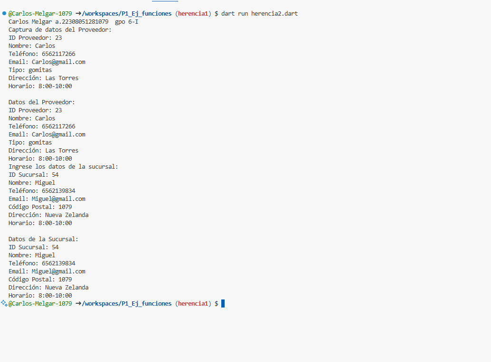

- crear dos clase una llamada proovedores con los atributos (id_proveedores, nombre, telefono, email, tipo, direccion, horario) y la otra llamada sucursales con atributos(id_sucursal, nombre, telefono, email, codigo_postal, direccion, horario), con una funcion capturadatos(). con interaccion de interfaz de usuario. crear la clase DatosProveedor y DatosSucursal con herencia Proveedor y sucursal y una funcion mostrarDatos(). lenguaje dart

