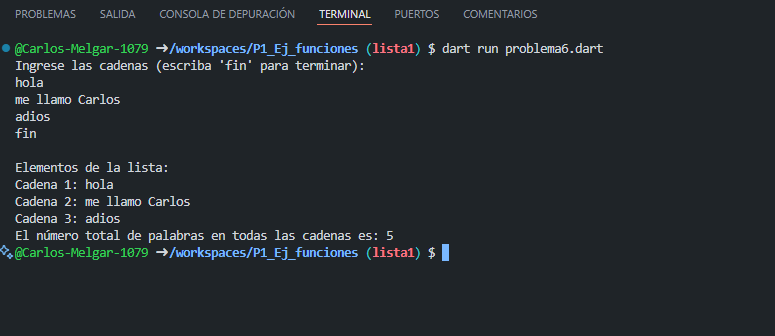

Implementa un programa que tome una lista de cadenas (string) y cuente 8 cuántas palabras hay en total en todas las cadenas.que utilice 2 funciones una para capturar datos de la lista y otra para mostrar los elementos
Resolver un ejercicio de acuerdo a la asignación del problema

salida del problema 7:
